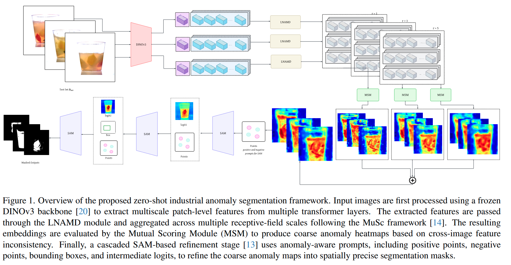

# EthMuSAM: Mutual Scoring With SAM For Zero-Shot Anomaly Segmentation

**VAND 4.0 Industrial Track — Zero-Shot Submission**

Authors: Md Abdullah Al Jubaer Gem | Tanjil Hasan Khan | Ibrahima Mamoudou | Shufan Shahi | Afra Anika

Institution: Islamic University of Technology, Gazipur, Bangladesh

[Paper (EthMuSAM.pdf)](./EthMuSAM.pdf) | Incremental work on [MuSc codebase](https://github.com/xrli-U/MuSc) ([ICLR 2024](https://arxiv.org/pdf/2401.16753.pdf))

---

## Abstract

EthMuSAM is a hybrid zero-shot industrial anomaly detection framework combining **DINOv3-MuSc** mutual scoring with a **cascaded SAM prompt refinement** module. DINOv3 patch features are scored via MuSc's mutual inconsistency mechanism to produce coarse anomaly heatmaps. A 3-pass SAM cascade then converts these into precise binary segmentation masks using anomaly-aware point prompts, dilation-ring negative points, and bounding boxes derived from SAM's own intermediate outputs. No training, fine-tuning, or category-specific optimization is performed.

**MVTec AD 2 results** (threshold 0.357525): mean SegF1 **27.78%**, AUROC-px **70.35%**, AUROC-im **68.51%**, AP-im **73.45%**.



---

## Method

Three stages, all frozen pretrained models:

**Stage 1 — Feature Extraction (DINOv3)**
- Backbone: `facebook/dinov3-vitl16-pretrain-lvd1689m`
- Input: 512×512, ImageNet normalization
- Layers used: `{6, 12, 18, 24}`

**Stage 2 — Mutual Scoring (MuSc)**
- **LNAMD**: aggregates patch features at radii r ∈ {1, 3, 5} per layer
- **MSM**: pairwise nearest-neighbor scoring across the unlabeled test batch — normal patches find many matches, anomalous patches find few
- Output: coarse per-pixel anomaly heatmap (4 layers × 3 scales, averaged)
- **RsCIN**: re-scores image-level classification using CLIP feature neighborhood (segmentation untouched)

**Stage 3 — Cascaded SAM Refinement** *(cascaded prompt strategy adapted from [ClipSAM](https://arxiv.org/abs/2510.11028))*
Given heatmap H:
1. Anomaly region R via adaptive Otsu thresholding (fallback: top-10 percentile)
2. Positive points: top-k spatially-spaced pixels from H 
3. Negative ring: lowest-H pixels from ellipse dilation of R minus R
4. **Pass 1**: SAM(points) → M1, logit1
5. **Pass 2**: SAM(points + logit1) → M2, logit2
6. **Pass 3**: SAM(points + bbox(M2) + logit2) → **M3** (final mask)

Raw heatmaps used for AUROC/AUPRO metrics; M3 used for SegF1.

---

## Results

### MVTec AD 2 (EthMuSAM — this paper)

| Category    | SegF1 | AUROC-px | AUROC-im | AP-px | AP-im | AUPRO | F1-px |
|-------------|-------|----------|----------|-------|-------|-------|-------|
| Can         | 0.00  | 52.37    | 52.47    | 0.00  | 27.57 | 7.59  | 0.00  |
| Fabric      | 55.55 | 87.96    | 48.37    | 43.94 | 51.47 | 22.45 | 57.20 |
| Fruit Jelly | 24.06 | 73.12    | 84.48    | 27.88 | 91.98 | 28.21 | 42.11 |
| Rice        | 36.76 | 67.21    | 70.69    | 23.40 | 84.87 | 20.12 | 40.75 |
| Sheet Metal | 23.44 | 51.68    | 74.57    | 10.97 | 88.68 | 50.24 | 26.18 |
| Vial        | 33.32 | 74.26    | 94.67    | 28.27 | 98.55 | 58.20 | 33.90 |
| Wallplugs   | 6.70  | 75.26    | 42.57    | 22.49 | 55.86 | 11.14 | 31.86 |
| Walnuts     | 42.41 | 80.94    | 80.24    | 52.69 | 88.58 | 23.80 | 60.78 |
| **Mean**    | **27.78** | **70.35** | **68.51** | **26.20** | **73.45** | **27.72** | **36.60** |

### MVTec AD (original MuSc baseline, ViT-L-14-336 @ 518px)

| AUROC-cls | F1-max-cls | AP-cls | AUROC-segm | F1-max-segm | AP-segm | PRO-segm |
|-----------|------------|--------|------------|-------------|---------|----------|
| 97.77     | 97.37      | 99.07  | 97.11      | 62.16       | 62.26   | 93.45    |

### VisA (original MuSc baseline, ViT-L-14-336 @ 518px)

| AUROC-cls | F1-max-cls | AP-cls | AUROC-segm | F1-max-segm | AP-segm | PRO-segm |
|-----------|------------|--------|------------|-------------|---------|----------|
| 92.57     | 89.06      | 93.31  | 98.71      | 48.90       | 45.38   | 92.43    |

See original MuSc for full per-backbone and per-category breakdowns.

---

## Setup

**Requirements**: Python 3.10+, CUDA 12.1, PyTorch 2.4.0

```bash
git clone <this-repo>
conda create --name ml python=3.10
conda activate ml
pip install torch==2.4.0 torchvision==0.19.0 torchaudio==2.4.0 --index-url https://download.pytorch.org/whl/cu121
pip install -r requirements.txt
```

**SAM checkpoint** (ViT-H, ~2.4GB) — for `--sam_version sam1`:
Place at `models/sam_vit_h.pth`. Download from [Meta's SAM releases](https://github.com/facebookresearch/segment-anything#model-checkpoints).

**SAM3 checkpoint** — for `--sam_version sam3` (default):
Gated model — [request access](https://huggingface.co/facebook/sam3) first, then:

- **Local (recommended):** `huggingface-cli download facebook/sam3 --local-dir models/sam3`
- **Auto:** set `--sam3_model_id facebook/sam3` — downloads on first run (requires HF auth).

SAM3 uses `Sam3TrackerModel` + `Sam3TrackerProcessor` from `transformers`. Requires `transformers>=5.0`.

**DINOv3 backbone** (`facebook/dinov3-vitl16-pretrain-lvd1689m`) — gated model, [request access](https://huggingface.co/facebook/dinov3-vitl16-pretrain-lvd1689m) first. Downloads automatically on first run once authenticated.

---

## Datasets

Place all datasets under `./data/`. Some datasets require a preprocessing script from `datasets/` to generate a metadata JSON before the loader can read them. So run the dataset_name.py files for those datasets. Then proceed with the next steps. For this work our main dataset is MVTec AD 2 . And MVTec AD was used for finding threshold only.

**MVTec AD 2** (primary — this paper):
```
data/mvtec_ad_2/
  can/ fabric/ fruit_jelly/ rice/ sheet_metal/ vial/ wallplugs/ walnuts/
  meta_mvtec2.json   ← bundled with the official download; must be present
```
No script needed — `meta_mvtec2.json` ships with the dataset.

**MVTec AD**:
```
data/mvtec_anomaly_detection/
  bottle/ cable/ capsule/ ... (15 categories)
```
No preprocessing needed.

**VisA** — requires preprocessing after download to generate `meta.json`:
```bash
python ./datasets/visa_preprocess.py
```
---

## Running

### Step 1 — Download pretrained weights

Both models are **gated on HuggingFace** — request access on each model page before downloading:

- DINOv3: https://huggingface.co/facebook/dinov3-vitl16-pretrain-lvd1689m
- SAM3: https://huggingface.co/facebook/sam3

Then authenticate and download:

```bash
huggingface-cli login   # paste your HF token with read access

# SAM3 — download locally (recommended, ~2GB):
huggingface-cli download facebook/sam3 --local-dir models/sam3

# DINOv3 — auto-downloads on first run once authenticated.
# To pre-download: huggingface-cli download facebook/dinov3-vitl16-pretrain-lvd1689m
```

Alternatively, set `HF_TOKEN=<your_token>` in your environment instead of `huggingface-cli login`.

### Step 2 — Calibrate threshold (on independent dataset)

```bash
# Option A: calibrate on MVTec AD1
python scripts/find_threshold_mvtec1.py --data_path ./data/mvtec_anomaly_detection/

# Option B: calibrate on VisA
python scripts/find_threshold_visa.py --data_path ./data/visa/
```

### Step 3 — Evaluate on MVTec AD 2 test_public

```bash
python src/test.py \
    --data_path ./data/mvtec_ad_2/ \
    --threshold 0.357525
```

### Step 4 — Generate submission

```bash
python src/submit.py \
    --data_path ./data/mvtec_ad_2/ \
    --threshold 0.357525
# or: sh scripts/run_generate_submission_dinov3.sh
```

### Optional: SAM1 backend

```bash
python src/test.py \
    --data_path ./data/mvtec_ad_2/ --threshold 0.357525 \
    --sam_version sam1 --sam_checkpoint models/sam_vit_h.pth
```

### Optional: MuSc CLIP baseline (reference)

```bash
python examples/musc_main.py   # follows configs/musc.yaml
sh scripts/musc.sh             # MVTec AD
sh scripts/musc_visa.sh        # VisA
sh scripts/musc_mvtec_ad2.sh  # MVTec AD 2
```

Key arguments (all entry points):
| Argument | Description |
|----------|-------------|
| `--backbone_name` | Feature extractor (CLIP/DINO/DINOv2/DINOv3) |
| `--img_resize` | Input resolution (224/256/336/512/518) |
| `--feature_layers` | ViT layers to extract from |
| `--r_list` | LNAMD aggregation radii |
| `--threshold` | Fixed segmentation threshold |
| `--use_sam` | Enable SAM cascade refinement (default: on) |
| `--sam_version` | `sam1` or `sam3` (default: `sam3`) |
| `--sam_checkpoint` | SAM1 ViT-H weights path |
| `--sam3_model_id` | SAM3 HuggingFace ID or local path |

---

## Key Files

| File | Role |
|------|------|
| `src/model.py` | `EthMuSAM` class — backbone loading, LNAMD/MSM inference, SAM refinement, submission saving |
| `src/test.py` | SegF1 evaluation on MVTec AD 2 test_public |
| `src/submit.py` | Generates submission archive for benchmark.mvtec.com |
| `sam_refiner.py` | `SAMRefiner` / `SAM3Refiner` — 3-pass cascaded SAM prompt strategy |
| `backbone/dinov3_backbone.py` | DINOv3 HuggingFace wrapper matching DINOv2 interface |
| `modules/_LNAMD.py` | Local Neighborhood Aggregation with Multiple Degrees |
| `modules/_MSM.py` | Mutual Scoring Mechanism |
| `scripts/find_threshold_mvtec1.py` | Threshold calibration on MVTec AD1 (independent) |
| `scripts/find_threshold_visa.py` | Threshold calibration on VisA (independent) |
| `scripts/eval_segf1_all.py` | Full evaluation across all three datasets |

---

## Citation

```bibtex
@article{gem2025ethmusam,
  title={EthMuSAM: Mutual Scoring With SAM For Zero Shot Anomaly Segmentation},
  author={Gem, Md Abdullah Al Jubaer and Khan, Tanjil Hasan and Mamoudou, Ibrahima and Shahi, Shufan and Anika, Afra},
  year={2025}
}

@inproceedings{Li2024MuSc,
  title={MuSc: Zero-Shot Industrial Anomaly Classification and Segmentation with Mutual Scoring of the Unlabeled Images},
  author={Li, Xurui and Huang, Ziming and Xue, Feng and Zhou, Yu},
  booktitle={International Conference on Learning Representations},
  year={2024}
}

@article{hou2025clipsam,
  title={Enhancing Zero-Shot Anomaly Detection: CLIP-SAM Collaboration with Cascaded Prompts},
  author={Hou, Yanning and Xu, Ke and Li, Junfa and Ruan, Yanran and Qiu, Jianfeng},
  journal={arXiv preprint arXiv:2510.11028},
  year={2025}
}
```

---

## Acknowledgements

EthMuSAM is an incremental extension of the [MuSc codebase](https://github.com/xrli-U/MuSc) (ICLR 2024) — core MuSc modules (LNAMD, MSM, RsCIN) are used as-is; EthMuSAM adds DINOv3 feature extraction and the cascaded SAM refinement stage on top. Also builds on [PatchCore](https://github.com/amazon-science/patchcore-inspection). SAM integration adapted from cascaded prompting strategies in [ClipSAM](https://arxiv.org/abs/2510.11028).

## License

EthMuSAM original contributions (DINOv3 backbone + cascaded SAM refinement) are released under **CC BY-NC 4.0**. Third-party modules retain their original licenses (MuSc: MIT; open_clip: MIT; DINOv2/SAM: Apache-2.0). See [LICENSE](./LICENSE) for full details.
